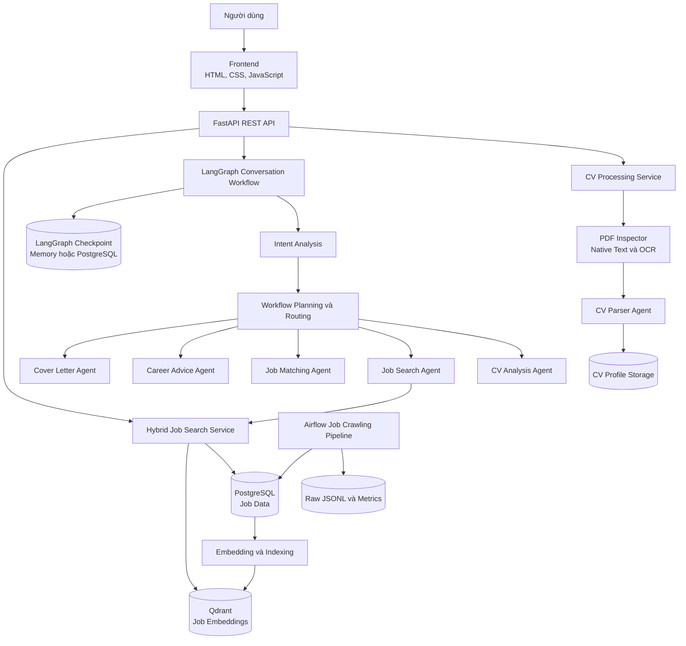
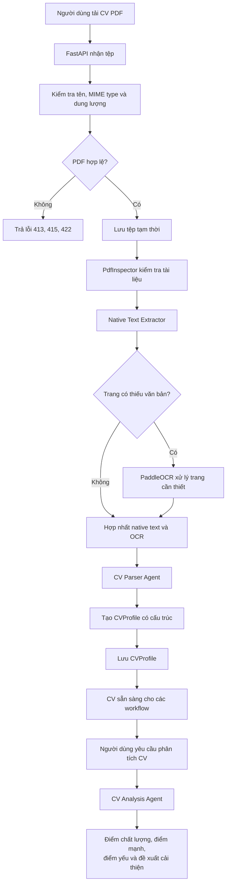
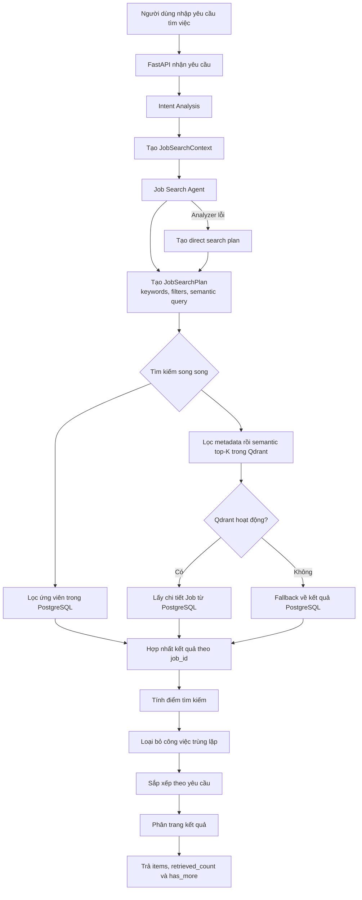
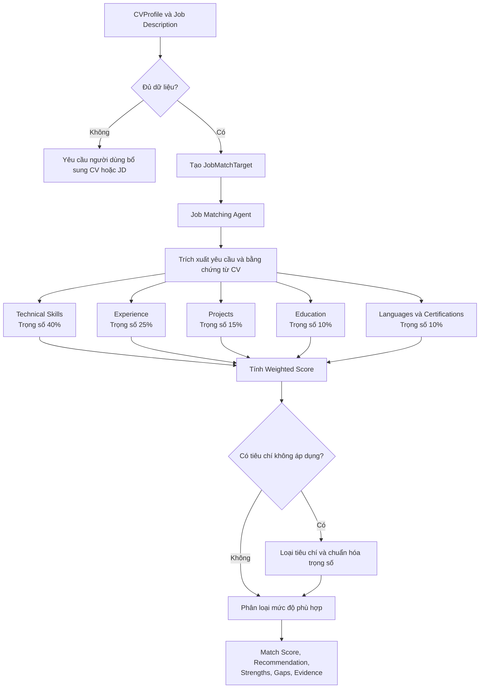
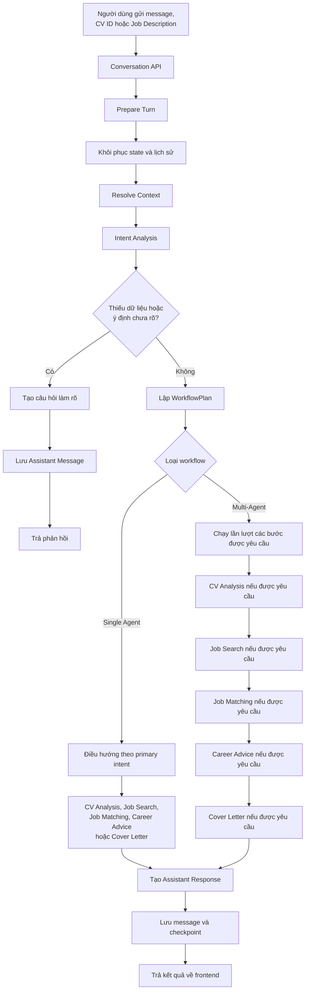
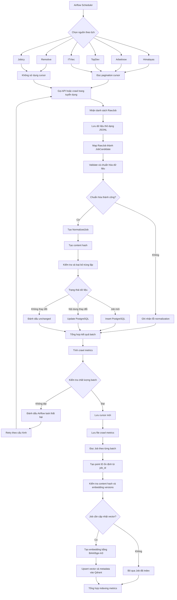
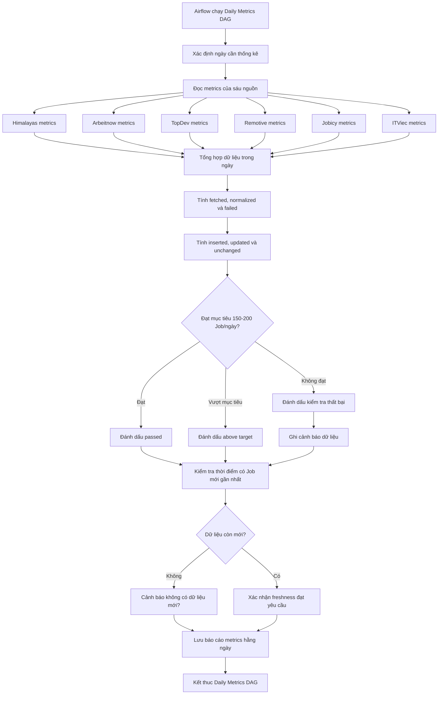

# Multi Agent Job Assistant

Multi Agent Job Assistant là hệ thống hỗ trợ tìm kiếm việc làm, phân tích CV, 
đánh giá mức độ phù hợp giữa ứng viên và công việc, tư vấn phát triển nghề nghiệp và 
tạo thư xin việc.

Hệ thống sử dụng LangGraph để điều phối workflow giữa các Agent, Langchain để làm việc với LLM, 
PostgreSQL để lưu dữ liệu việc làm, Qdrant để tìm kiếm ngữ nghĩa và 
Airflow để thu thập dữ liệu việc làm theo lịch.

## Chức năng hiện tại 

- Tải lên và kiểm trả CV định dạng PDF.
- Trích xuất nội dung PDF.
- Sử dụng OCR đối với các trang không có đủ nội dung văn bản.
- Chuyển nội dung CV thành dữ liệu có cấu trúc.
- Phân tích chất lượng CV.
- Tìm kiếm việc làm bàngw PostgreSQL và Qdrant.
- Kết hợp độ phù hợp nội dung, từ khóa và độ mới của việc làm.
- So khớp CV với JD (Job Description).
- Giải thích điểm mạnh, điểm yếu và kỹ năng còn thiếu.
- Đưa ra định hướng và lộ trình phát triển nghề nghiệp.
- Tạo thư xin việc dựa trên CV và JD (Job Description).
- Lưu lịch sử hội thoại bằng LangGraph Checkpoint.
- Thu thập việc làm tự động bằng Airflow.
- Hiển thị kết quả trên frontend HTML, CSS, JavaScript.

## Các Agent

| Agent | Trách nhiệm |
|---|---|
| CV Parser Agent | Chuyển nội dung CV thành dữ liệu có cấu trúc |
| CV Analysis Agent | Phân tích chất lượng, điểm mạnh và điểm yếu của CV |
| Job Search Agent | Phân tích yêu cầu tìm việc và tạo kế hoạch tìm kiếm |
| Job Matching Agent | Đánh giá mức độ phù hợp giữa CV và công việc |
| Career Advice Agent | Đưa ra kỹ năng, lộ trình và định hướng nghề nghiệp |
| Cover Letter Agent | Tạo cover letter dựa trên CV và công việc |

Mỗi Agent có input/output được định nghĩa bằng Pydantic và không trao đổi với nhau
thông qua văn bản tự do.

## Kiến trúc hệ thống 
Xem mô tả chi tiết tại: [Kiến trúc hệ thống hiện tại](docs/architecture-as-is.md).



## Luồng hoạt động chính

### 1. Phân tích CV



### 2. Tìm kiếm việc làm



Các filter location, employment type, work mode, seniority, skills, khoảng
lương, currency, salary period, ngày đăng và trạng thái hết hạn được đẩy vào
Qdrant trước khi chọn semantic top-K. PostgreSQL vẫn áp dụng lại cùng bộ lọc
khi tải chi tiết job. Location được so khớp qua khóa không dấu và các alias
phổ biến như `HCMC`, `TP.HCM`, `Sài Gòn`, `Hanoi` và `Đà Nẵng`.

Filter lương chỉ hợp lệ khi có cả `salary_currency` và `salary_period`; hệ
thống không tự quy đổi giữa lương tháng và lương năm. `total` là số kết quả đã
deduplicate trong cửa sổ ứng viên đã truy xuất, không phải phép đếm toàn bộ cơ
sở dữ liệu. `retrieved_count` cho biết số source record được hợp nhất và
`has_more` cho biết có thể tiếp tục phân trang.

Điểm tìm kiếm được tính từ ba thành phần:
```text
Final Score = 0.60 x Semantic Score + 0.30 x Keyword Score + 0.10 x Freshness Score
```

Các trọng số trên là baseline. Việc thay đổi cần được đánh giá bằng tập truy
vấn gán nhãn với Recall@K, nDCG@K và tỷ lệ vi phạm filter.

Trong đó:

    - Semantic Score: mức tương đồng về ý nghĩa giữa truy vấn và côngv việc.
    - Keyword Score: mực độ khớp từ khóa trong tiêu đề, kỹ năng và mô tả.
    - Freshness Score: mực độ mới của tin tuyển dụng

### 3. So khớp CV với JD



Các mức kết quả:

| Điểm | Mức độ phù hợp |
|---|---|
| Từ 85 trở lên | Strong Match |
| Từ 70 đến dưới 85 | Good Match |
| Từ 50 đến dưới 70 | Partial Match |
| Dưới 50 | Low Match |

### 4. Multi-Agent workflow



## Công thức tìm kiếm Hybrid

 Điểm xếp hạng việc làm được tổng hợp từ:

```text
Final Score = 0.60 x Semantic Score + 0.30 x Keyword Score + 0.10 x Freshness Score
```

Khi Qdrant không hoạt động, hệ thống có thể chuyển sang tìm kiếm bằng PostgreSQL.

## Công thức Job Matching

| Tiêu chí | Trọng số |
|---|---:|
| Technical Skills | 40% |
| Experience | 25% |
| Projects | 15% |
| Education | 10% |
| Language and Certifications | 10% |

# Job Crawling Pipeline

Airflow thu thập việc làm từ sáu nguồn:

- Himalayas
- Arbeitnow
- TopDev
- Remotive
- Jobicy
- ITViec

Pipeline thực hiện:



Mỗi bản ghi nguồn có một vector riêng trong collection
`jobs_bge_m3_v2`. Kết quả từ nhiều nguồn chỉ được loại trùng sau khi
PostgreSQL và Qdrant đã hợp nhất, tránh để các DAG nguồn ghi đè vector của
nhau. Cần tăng `EMBEDDING_MODEL_VERSION` khi thay đổi model/checkpoint và tăng
`JOB_EMBEDDING_TEXT_VERSION` khi thay đổi cấu trúc văn bản đầu vào embedding.

Sau khi triển khai phiên bản này, cần chạy một lần lệnh sau trong backend để
nạp toàn bộ job hiện có vào collection `v2` và bổ sung metadata phục vụ filter:

```bash
python -m app.cli index-jobs --batch-size 100
```

### Luồng tổng hợp metrics hàng ngày




## Công nghệ sử dụng

### Backend

- Python 3.12
- FastAPI
- Pydantic
- LangChain
- LangGraph
- LangSmith
- SQLAlchemy
- PostgreSQL
- Qdrant
- BAAI/bge-m3
- PaddleOCR
- PyMuPDF
- Apache Airflow

### Frontend

- HTML
- CSS
- Vanilla JavaScript
- Fetch API
- Vite

## Cấu trúc thư mục

```text
multi-agent-job-assistant/
├── backend/
│   ├── alembic/
│   └── app/
│       ├── agents/
│       ├── api/
│       ├── core/
│       ├── crawlers/
│       ├── database/
│       ├── embeddings/
│       ├── graphs/
│       ├── llm/
│       ├── memory/
│       ├── normalizers/
│       ├── prompts/
│       ├── repositories/
│       ├── schemas/
│       ├── services/
│       └── vectorstores/
├── airflow/
│   ├── dags/
│   └── docker-compose.yaml
├── frontend/
│   ├── src/
│   └── index.html
└── images/
```

## Cài đặt backend

```powershell
cd backend
python -m venv venv
.\venv\Scripts\Activate.ps1
pip install -r requirements.txt
Copy-Item .env.example .env
```

Cập nhật các biến môi trường cần thiết trong `backend/.env`.

Không đưa API key hoặc nội dung file `.env` lên GitHub.

Chạy migration:

```powershell
alembic upgrade head
```

Chạy backend:

~~~powershell
uvicorn app.main:app --reload
~~~

Chạy CV worker ở terminal riêng:

~~~powershell
python -m app.cli cv-worker
~~~

Upload CV trả về HTTP 202 cùng task_id. Frontend kiểm tra
GET /api/v1/cvs/processing-tasks/{task_id} với exponential backoff cho đến
khi task chuyển sang completed hoặc failed. Task, retry count và processing
lease được lưu trong PostgreSQL nên có thể tiếp tục sau khi API hoặc worker
khởi động lại.

Có thể xử lý tối đa một task rồi thoát để kiểm tra vận hành:

~~~powershell
python -m app.cli cv-worker --once
~~~

Khi dùng Docker Compose, service backend và cv-worker dùng chung
backend_storage volume:

~~~powershell
docker compose -f compose.backend.yaml up --build
~~~

Backend mặc định:

```text
http://127.0.0.1:8000
```

Swagger UI:

```text
http://127.0.0.1:8000/docs
```

## Chạy frontend

```powershell
cd frontend
npm install
npm run dev
```

Frontend mặc định:

```text
http://127.0.0.1:5173
```

## Trạng thái hiện tại

Đã hoàn thành:

- Các Agent chính.
- LangGraph orchestration.
- Hybrid Job Search.
- CV–Job Matching.
- Conversation Memory.
- Airflow crawling pipeline.
- Frontend demo.

Đang hoàn thiện:

- Automated testing.
- LangSmith evaluation.
- Human-in-the-loop.
- Authentication và phân quyền.
- Health check cho PostgreSQL và Qdrant.
- Docker và deployment production.
- Đánh giá chất lượng trên bộ dữ liệu thực nghiệm.

## Hạn chế

- Hiện chỉ hỗ trợ CV dạng PDF.
- CV đang được lưu trên local storage.
- Chưa có tài khoản và phân quyền người dùng.
- Chưa có bộ kiểm thử tự động đầy đủ.
- Matching score chưa được hiệu chỉnh trên bộ dữ liệu tuyển dụng thực tế.
- Human-in-the-loop chưa hoàn thiện.
- Chưa có hệ thống đánh giá LLM tự động.

## Định hướng tiếp theo

1. Bổ sung unit test và integration test.
2. Thêm GitHub Actions CI.
3. Xây dựng LangSmith evaluation dataset.
4. Đánh giá Intent Analysis, Job Search và Job Matching.
5. Hoàn thiện human-in-the-loop.
6. Bổ sung authentication và bảo vệ dữ liệu CV.
7. Triển khai frontend và backend.
