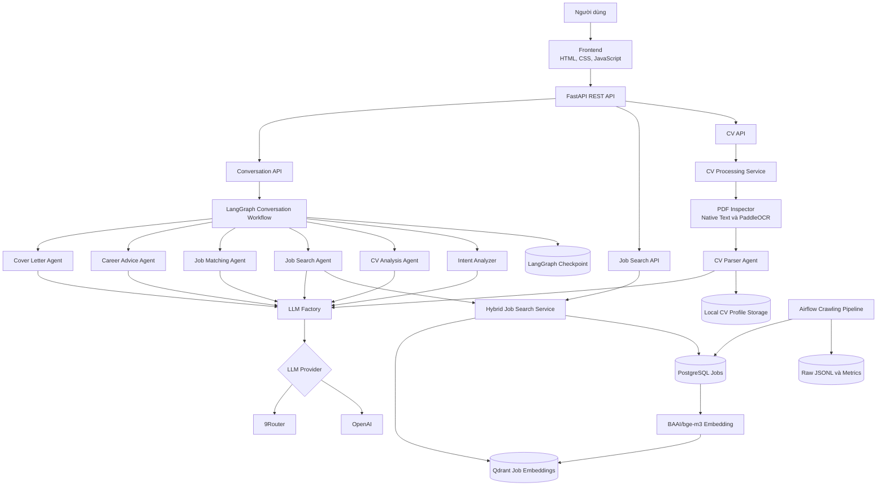
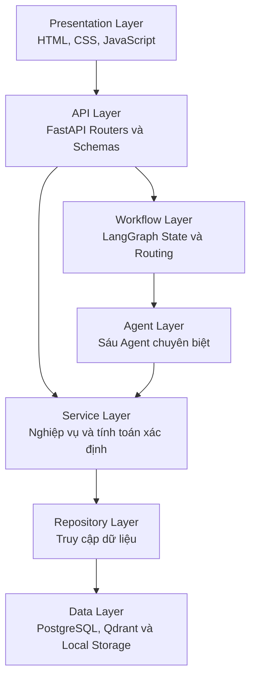
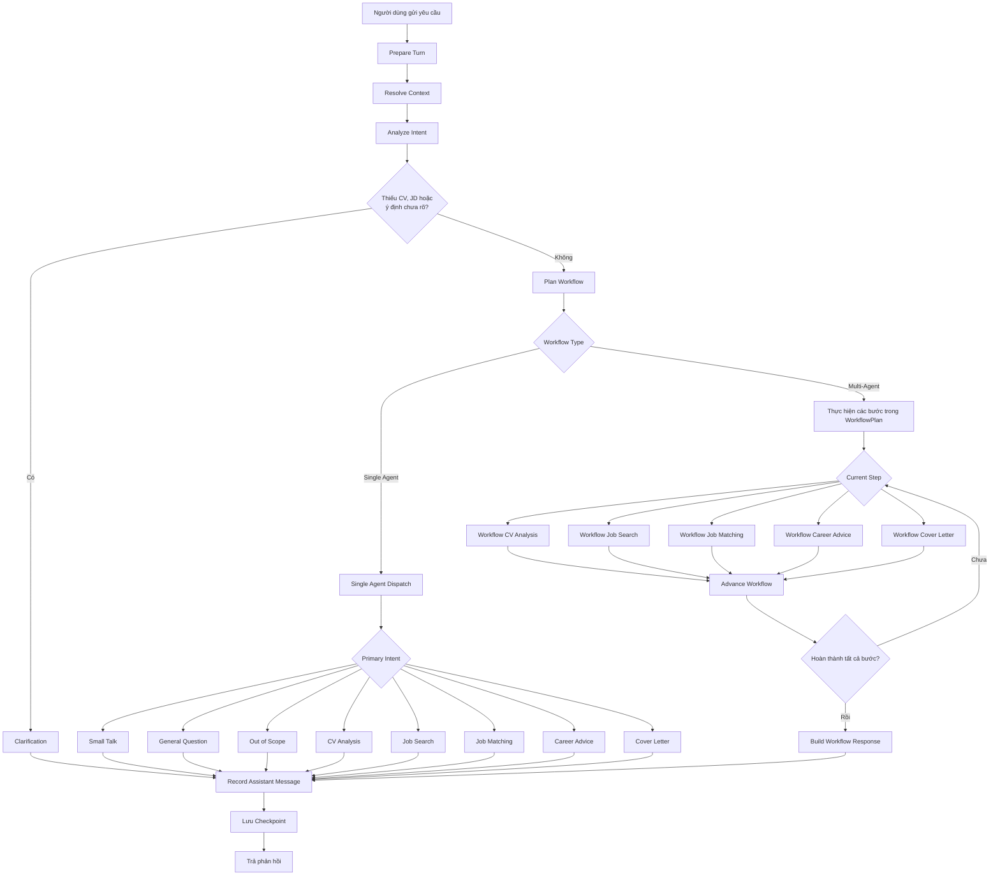
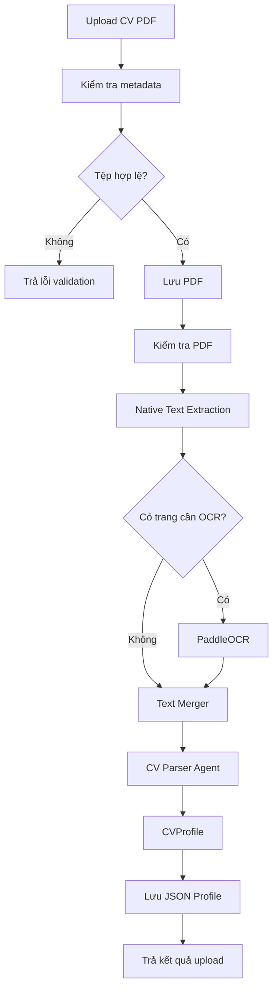
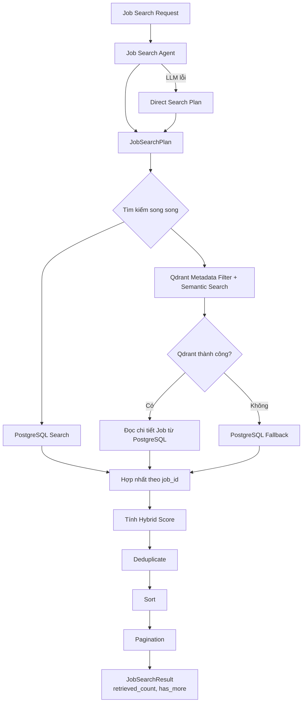
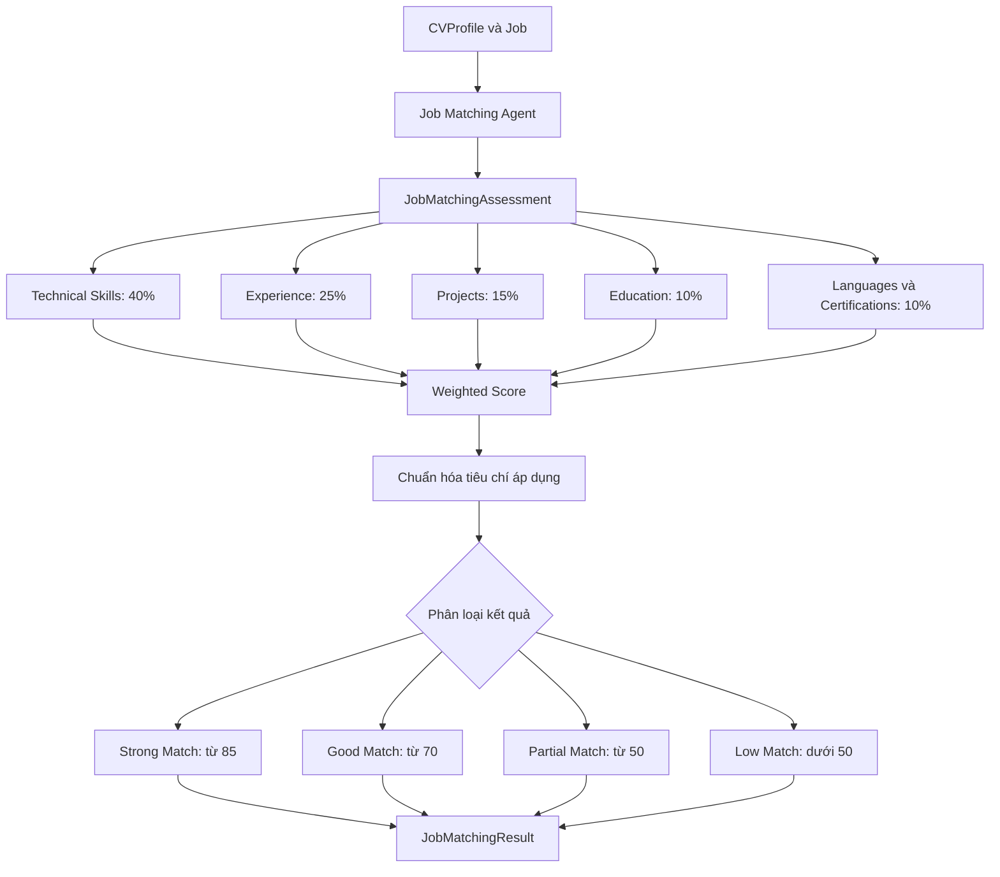
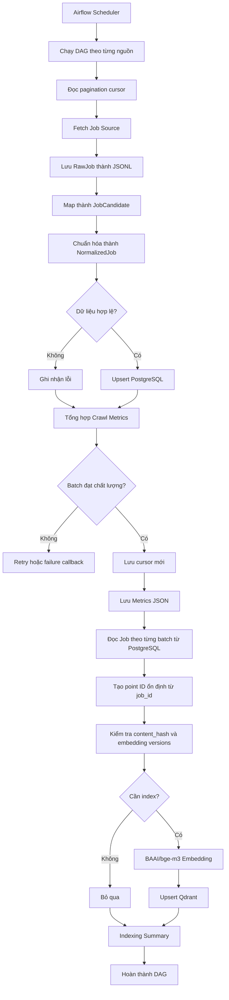

# Kiến trúc hệ thống hiện tại – As-is Architecture

Tài liệu này mô tả kiến trúc đã được triển khai trên nhánh `main` của hệ thống
Multi-Agent Job Assistant.

Những thành phần chưa triển khai như authentication, Redis, MinIO,
Interview Agent và Human-in-the-loop không thuộc kiến trúc As-is.

## 1. Kiến trúc tổng thể



## 2. Các tầng kiến trúc



### Presentation Layer

Frontend sử dụng:

- HTML.
- CSS.
- Vanilla JavaScript.
- Fetch API.
- Vite.

Frontend chịu trách nhiệm:

- Tải CV.
- Nhập câu hỏi.
- Nhập Job Description.
- Hiển thị danh sách việc làm.
- Hiển thị kết quả CV Analysis.
- Hiển thị Job Matching.
- Hiển thị Career Advice và Cover Letter.
- Quản lý danh sách cuộc hội thoại trên trình duyệt.

Mã nguồn chính:

```text
frontend/index.html
frontend/src/main.js
frontend/src/api/
frontend/src/features/
frontend/src/css/
```

### API Layer

FastAPI cung cấp các nhóm API:

| API | Trách nhiệm |
|---|---|
| Health API | Kiểm tra trạng thái FastAPI |
| CV API | Upload, kiểm tra và xử lý CV |
| Job API | Tìm kiếm việc làm |
| Conversation API | Điều phối hội thoại và lấy lịch sử |

Mã nguồn chính:

```text
backend/app/main.py
backend/app/api/router.py
backend/app/api/v1/router.py
backend/app/api/v1/endpoints/
```

### Workflow Layer

LangGraph chịu trách nhiệm:

- Lưu Conversation State.
- Khôi phục conversation context.
- Phân tích ý định.
- Kiểm tra dữ liệu còn thiếu.
- Lập kế hoạch workflow.
- Điều hướng đến Agent.
- Chạy multi-agent workflow.
- Lưu checkpoint và lịch sử hội thoại.

Mã nguồn chính:

```text
backend/app/graphs/conversation/state.py
backend/app/graphs/conversation/builder.py
backend/app/graphs/conversation/routing.py
backend/app/graphs/conversation/planning.py
backend/app/graphs/conversation/nodes.py
backend/app/graphs/conversation/workflow.py
```

### Agent Layer

Hệ thống hiện có sáu Agent:

| Agent | Input chính | Output chính |
|---|---|---|
| CV Parser Agent | Nội dung CV | CVProfile |
| CV Analysis Agent | CVProfile | CVAnalysisResult |
| Job Search Agent | Truy vấn và CV context | JobSearchPlan |
| Job Matching Agent | CVProfile và Job | JobMatchingAssessment |
| Career Advice Agent | CV và matching evidence | CareerAdviceResult |
| Cover Letter Agent | CV và Job Description | CoverLetterResult |

Mã nguồn:

```text
backend/app/agents/
backend/app/prompts/
backend/app/schemas/
```

Mỗi Agent chỉ thực hiện một trách nhiệm và sử dụng structured output thay vì
trả dữ liệu tự do cho Agent khác.

### Service Layer

Service Layer chứa nghiệp vụ không nên đặt trực tiếp trong Agent hoặc API.

Các trách nhiệm chính:

- Xử lý file CV.
- Hợp nhất native text và OCR.
- Tính điểm Job Matching.
- Tìm kiếm và xếp hạng việc làm.
- Điều phối conversation.
- Thu thập và chuẩn hóa job.

Mã nguồn:

```text
backend/app/services/
```

### Repository Layer

Repository Layer tách nghiệp vụ khỏi cách lưu trữ dữ liệu.

Mã nguồn:

```text
backend/app/repositories/
```

Các repository hiện tại chịu trách nhiệm:

- Lưu và đọc CVProfile.
- Lưu dữ liệu job dạng JSONL.
- Upsert job vào PostgreSQL.
- Truy vấn ứng viên việc làm.
- Đọc job phục vụ quá trình indexing.

### Data Layer

| Thành phần | Dữ liệu |
|---|---|
| PostgreSQL | Job đã chuẩn hóa |
| PostgreSQL Checkpoint | Trạng thái và lịch sử LangGraph |
| Qdrant | Vector embedding của việc làm |
| Local Storage | Tệp CV PDF và CVProfile |
| JSONL | Dữ liệu job thô |
| Metrics JSON | Kết quả crawl theo batch và theo ngày |

## 3. Luồng Conversation Workflow



## 4. Luồng CV Processing



## 5. Luồng Hybrid Job Search



Qdrant áp dụng metadata filter trước semantic top-K. PostgreSQL xác nhận lại
filter khi tải source record. Hai tầng dùng cùng quy tắc salary currency và
salary period; không có quy đổi ngầm giữa tháng và năm. Location trên Qdrant
dùng `location_keys` đã chuẩn hóa, còn PostgreSQL mở rộng các alias phổ biến
trước khi tạo điều kiện `ILIKE`.

`total` chỉ là số job deduplicate trong cửa sổ ứng viên đã truy xuất.
`retrieved_count` là số source record sau khi hợp nhất và `has_more` thể hiện
khả năng còn trang tiếp theo; API không mô tả `total` như tổng chính xác của
toàn bộ database.

Công thức:

```text
Final Score =
    0.60 × Semantic Score
  + 0.30 × Keyword Score
  + 0.10 × Freshness Score
```

## 6. Luồng Job Matching



## 7. Luồng Job Crawling và Indexing



Qdrant lưu riêng từng source record bằng point ID được dẫn xuất ổn định từ
`job_id`. Chữ ký quyết định reindex gồm `content_hash`,
`embedding_model_version` và `embedding_text_version`. Deduplicate liên nguồn
được thực hiện trên kết quả tìm kiếm, không thực hiện bằng cách cho các nguồn
dùng chung một Qdrant point.

Khi chuyển từ collection `jobs_bge_m3_v1` sang `jobs_bge_m3_v2`, chạy full
sync bằng `python -m app.cli index-jobs --batch-size 100`. Các DAG sau đó tiếp
tục index tăng dần theo `job_ids` của từng batch crawl.

Khi `index_payload_version` thay đổi, cũng cần chạy full sync để các point cũ
có đủ metadata filter và payload index tương ứng.

## 8. Thành phần chưa được triển khai

Các thành phần sau thuộc định hướng tương lai, không phải kiến trúc As-is:

- Authentication và JWT.
- Phân quyền người dùng.
- Redis hoặc Celery.
- MinIO hoặc S3.
- Interview Preparation Agent.
- Result Synthesis Agent độc lập.
- Human-in-the-loop hoàn chỉnh.
- Rate limiting.
- Qdrant collection dành riêng cho CV.
- Production deployment hoàn chỉnh.
- LangSmith evaluation dataset.

Các thành phần này chỉ nên xuất hiện trong phần kiến trúc đề xuất hoặc hướng
phát triển của báo cáo.
